MC\_paper2\_phyloseq\_import
================
Zeya Xue
January 14, 2019

Written by Zhengyao "Zeya" Xue, [ORCID](https://orcid.org/0000-0002-4930-8212)

This file follows the analysis in QIIME2, which imports mapping file, feature table, taxonomy and tree as a 4-component phyloseq object.

Setting up packages and working directory
-----------------------------------------

``` r
library(phyloseq);packageVersion("phyloseq")
```

    ## [1] '1.22.3'

``` r
library(vegan);packageVersion("vegan")
```

    ## Warning: package 'vegan' was built under R version 3.4.4

    ## Loading required package: permute

    ## Loading required package: lattice

    ## This is vegan 2.5-1

    ## [1] '2.5.1'

``` r
library(ggplot2);packageVersion("ggplot2")
```

    ## Warning: package 'ggplot2' was built under R version 3.4.4

    ## [1] '3.1.0'

``` r
library(ggpubr); packageVersion("ggpubr") #  ggplot2 based publication ready fig
```

    ## Warning: package 'ggpubr' was built under R version 3.4.4

    ## Loading required package: magrittr

    ## [1] '0.2'

``` r
library(reshape2);packageVersion("reshape2")
```

    ## Warning: package 'reshape2' was built under R version 3.4.3

    ## [1] '1.4.3'

``` r
library(cowplot);packageVersion("cowplot")
```

    ## Warning: package 'cowplot' was built under R version 3.4.3

    ## 
    ## Attaching package: 'cowplot'

    ## The following object is masked from 'package:ggpubr':
    ## 
    ##     get_legend

    ## The following object is masked from 'package:ggplot2':
    ## 
    ##     ggsave

    ## [1] '0.9.2'

``` r
library(superheat)
library(plyr)
```

    ## 
    ## Attaching package: 'plyr'

    ## The following object is masked from 'package:ggpubr':
    ## 
    ##     mutate

``` r
library(dplyr)
```

    ## Warning: package 'dplyr' was built under R version 3.4.4

    ## 
    ## Attaching package: 'dplyr'

    ## The following objects are masked from 'package:plyr':
    ## 
    ##     arrange, count, desc, failwith, id, mutate, rename, summarise,
    ##     summarize

    ## The following objects are masked from 'package:stats':
    ## 
    ##     filter, lag

    ## The following objects are masked from 'package:base':
    ## 
    ##     intersect, setdiff, setequal, union

``` r
library(DESeq2)
```

    ## Loading required package: S4Vectors

    ## Loading required package: stats4

    ## Loading required package: BiocGenerics

    ## Loading required package: parallel

    ## 
    ## Attaching package: 'BiocGenerics'

    ## The following objects are masked from 'package:parallel':
    ## 
    ##     clusterApply, clusterApplyLB, clusterCall, clusterEvalQ,
    ##     clusterExport, clusterMap, parApply, parCapply, parLapply,
    ##     parLapplyLB, parRapply, parSapply, parSapplyLB

    ## The following objects are masked from 'package:dplyr':
    ## 
    ##     combine, intersect, setdiff, union

    ## The following objects are masked from 'package:stats':
    ## 
    ##     IQR, mad, sd, var, xtabs

    ## The following objects are masked from 'package:base':
    ## 
    ##     anyDuplicated, append, as.data.frame, cbind, colMeans,
    ##     colnames, colSums, do.call, duplicated, eval, evalq, Filter,
    ##     Find, get, grep, grepl, intersect, is.unsorted, lapply,
    ##     lengths, Map, mapply, match, mget, order, paste, pmax,
    ##     pmax.int, pmin, pmin.int, Position, rank, rbind, Reduce,
    ##     rowMeans, rownames, rowSums, sapply, setdiff, sort, table,
    ##     tapply, union, unique, unsplit, which, which.max, which.min

    ## 
    ## Attaching package: 'S4Vectors'

    ## The following objects are masked from 'package:dplyr':
    ## 
    ##     first, rename

    ## The following object is masked from 'package:plyr':
    ## 
    ##     rename

    ## The following object is masked from 'package:base':
    ## 
    ##     expand.grid

    ## Loading required package: IRanges

    ## 
    ## Attaching package: 'IRanges'

    ## The following objects are masked from 'package:dplyr':
    ## 
    ##     collapse, desc, slice

    ## The following object is masked from 'package:plyr':
    ## 
    ##     desc

    ## The following object is masked from 'package:phyloseq':
    ## 
    ##     distance

    ## Loading required package: GenomicRanges

    ## Warning: package 'GenomicRanges' was built under R version 3.4.3

    ## Loading required package: GenomeInfoDb

    ## Loading required package: SummarizedExperiment

    ## Warning: package 'SummarizedExperiment' was built under R version 3.4.3

    ## Loading required package: Biobase

    ## Welcome to Bioconductor
    ## 
    ##     Vignettes contain introductory material; view with
    ##     'browseVignettes()'. To cite Bioconductor, see
    ##     'citation("Biobase")', and for packages 'citation("pkgname")'.

    ## 
    ## Attaching package: 'Biobase'

    ## The following object is masked from 'package:phyloseq':
    ## 
    ##     sampleNames

    ## Loading required package: DelayedArray

    ## Loading required package: matrixStats

    ## Warning: package 'matrixStats' was built under R version 3.4.3

    ## 
    ## Attaching package: 'matrixStats'

    ## The following objects are masked from 'package:Biobase':
    ## 
    ##     anyMissing, rowMedians

    ## The following object is masked from 'package:dplyr':
    ## 
    ##     count

    ## The following object is masked from 'package:plyr':
    ## 
    ##     count

    ## 
    ## Attaching package: 'DelayedArray'

    ## The following objects are masked from 'package:matrixStats':
    ## 
    ##     colMaxs, colMins, colRanges, rowMaxs, rowMins, rowRanges

    ## The following object is masked from 'package:base':
    ## 
    ##     apply

Import QIIME2 output and make phyloseq object
---------------------------------------------

2/5/19: add Phase 3 results and import as the same ps object

``` r
# Transpose the QIIME2 output in excel
# For the theoretical values, I can adjust its absolute reads to suit data set by
# changing values in the feature table
SeqTab <- read.table(file.path("data/5file-combined_table-dada2-mc2.txt"), header = TRUE, stringsAsFactors = FALSE)
colnames(SeqTab) <- gsub("X","",colnames(SeqTab))
row.names(SeqTab) <- SeqTab$OTUID
SeqTab <- SeqTab[,-1]
SeqTab <- as.matrix.data.frame(SeqTab)

# Read in metadata file
samdf <- read.csv(file.path("data/5file-MC_paper2_samdf.csv"))
rownames(samdf) <- samdf$SampleID

# Read in exported rooted tree 
tree <- read_tree(file.path("data/5file-tree.nwk"))

# Parse out taxonomic assignment in excel and remove confidence column
# keep only taxa included in the "feature-table-mc2.csv" file
# Species column removed
TaxTab <- read.table(file.path("data/5file-taxonomy-mc2.tsv"), header = TRUE, sep = '\t', na.strings = NA)
rownames(TaxTab) <- TaxTab$FeatureID
TaxTab <- TaxTab[,-1]
TaxTab <- as.matrix.data.frame(TaxTab)

# merge as the phyloseq ready to use
ps <- phyloseq(otu_table(SeqTab, taxa_are_rows = TRUE), tax_table(TaxTab),sample_data(samdf), phy_tree(tree))
ps # 1052 taxa and 212 samples 
```

    ## phyloseq-class experiment-level object
    ## otu_table()   OTU Table:         [ 1052 taxa and 212 samples ]
    ## sample_data() Sample Data:       [ 212 samples by 14 sample variables ]
    ## tax_table()   Taxonomy Table:    [ 1052 taxa by 6 taxonomic ranks ]
    ## phy_tree()    Phylogenetic Tree: [ 1052 tips and 1050 internal nodes ]

``` r
# Filter out singleton
ps <- filter_taxa(ps, function (x) {sum(x > 0) > 1}, prune=TRUE)
ps # 1049 taxa and 212 samples
```

    ## phyloseq-class experiment-level object
    ## otu_table()   OTU Table:         [ 1049 taxa and 212 samples ]
    ## sample_data() Sample Data:       [ 212 samples by 14 sample variables ]
    ## tax_table()   Taxonomy Table:    [ 1049 taxa by 6 taxonomic ranks ]
    ## phy_tree()    Phylogenetic Tree: [ 1049 tips and 1047 internal nodes ]

Filter ASVs based on taxonomy and abundance
-------------------------------------------

``` r
# Show available ranks in the dataset
rank_names(ps)
```

    ## [1] "Kingdom" "Phylum"  "Class"   "Order"   "Family"  "Genus"

``` r
# Create table, number of features for each phylum
table(tax_table(ps)[, "Phylum"], exclude = NULL)
```

    ## 
    ##                        [Thermi]  Actinobacteria   Bacteroidetes 
    ##              36               7             115             193 
    ##     Chloroflexi   Crenarchaeota   Cyanobacteria   Euryarchaeota 
    ##               5               1              11               4 
    ##      Firmicutes    Fusobacteria  Proteobacteria    Spirochaetes 
    ##             434               3             214               8 
    ##   Synergistetes     Tenericutes Verrucomicrobia 
    ##               1              15               2

``` r
# remove asv that was not assigned at phylum level
ps.Phy <- subset_taxa(ps, !is.na(Phylum) & !Phylum %in% c(""))
ps.Phy # 1013 taxa and 212 samples
```

    ## phyloseq-class experiment-level object
    ## otu_table()   OTU Table:         [ 1013 taxa and 212 samples ]
    ## sample_data() Sample Data:       [ 212 samples by 14 sample variables ]
    ## tax_table()   Taxonomy Table:    [ 1013 taxa by 6 taxonomic ranks ]
    ## phy_tree()    Phylogenetic Tree: [ 1013 tips and 1011 internal nodes ]

``` r
# Explore abundance to decide filter threshold
## Compute prevalence of each feature, store as data.frame
prevdf <- apply(X = otu_table(ps.Phy),
                MARGIN = ifelse(taxa_are_rows(ps.Phy), yes = 1, no = 2),
                FUN = function(x)(sum(x>0)))
# Add taxonomy and total read counts to this data.frame
prevdf <- data.frame(Prevalence = prevdf,
                     TotalAbundance = taxa_sums(ps.Phy),
                     tax_table(ps.Phy))
# plot the abudance per phylum 
ggplot(prevdf, aes(TotalAbundance, Prevalence / nsamples(ps.Phy),color=Phylum)) +
  # Include a guess for parameter
  geom_hline(yintercept = 0.01,  linetype = 2) + geom_point(size = 2, alpha = 0.7) +
  scale_x_log10() +  xlab("Total Abundance") + ylab("Prevalence [Frac. Samples]") +
  facet_wrap(~Phylum) + theme(legend.position="none")
```

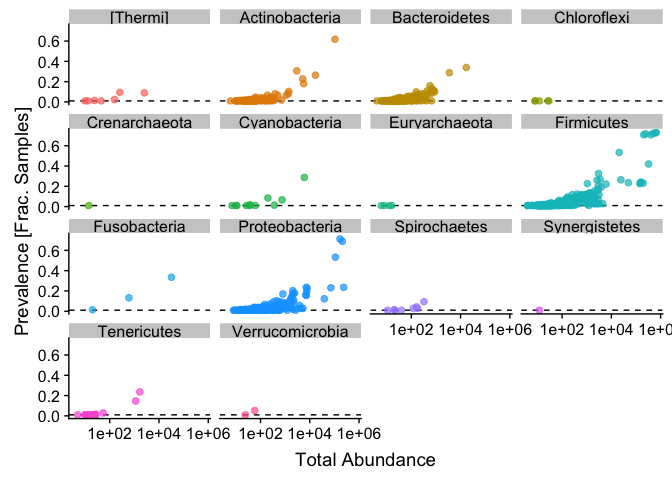

``` r
# Most bacteria are in the Actinobacteria, Bacteroidetes, Firmircutes and Proteobacteria
# But I don't actually have Bacteroidetes members...

# Remove very low abudance ASVs independent of sample prevalence
## At this level, will remove Corynebacterium in Theo, so will need to add it back in
x = taxa_sums(ps.Phy)
keepTaxa = which((x / sum(x)) > 0.00005) %>% data.frame() # taxa above threshold
## dummy value for corynebacterium ASV
coryTaxa <- data.frame("meow") 
colnames(coryTaxa) <- "."
row.names(coryTaxa) <- "fef753d7cbf02a6a16969e449c156909"
## add corynebacterium ASV to list
keepTaxa <- rbind(keepTaxa, coryTaxa)
ps.Phy05 <- prune_taxa(row.names(keepTaxa), ps.Phy)
ps.Phy05 # 198 taxa and 212 samples
```

    ## phyloseq-class experiment-level object
    ## otu_table()   OTU Table:         [ 198 taxa and 212 samples ]
    ## sample_data() Sample Data:       [ 212 samples by 14 sample variables ]
    ## tax_table()   Taxonomy Table:    [ 198 taxa by 6 taxonomic ranks ]
    ## phy_tree()    Phylogenetic Tree: [ 198 tips and 197 internal nodes ]

Determine rarefaction level for Alpha and Beta analysis later on
----------------------------------------------------------------

``` r
set.seed(123)
# Read in function to calculate alpha diversity and rarefaction levels
calculate_rarefaction_curves <-dget(file.path("function/FUN_calculate_rarefaction.R"))

rarefaction_curve_data <- calculate_rarefaction_curves(ps.Phy05, c("Observed", "Shannon","Simpson"), 
                                                       rep(c(1, 2500, 5000, 7500, 10000), each = 10))
rarefaction_curve_data$SampleID <- gsub("X","",rarefaction_curve_data$SampleID)
# summarize alpha diversity
rarefaction_curve_data_summary <- ddply(rarefaction_curve_data, c('Depth', 'SampleID', 'measures'), 
                                        summarise, 
                                        Alpha_diversity_mean = mean(Alpha_diversity), 
                                        Alpha_diversity_sd = sd(Alpha_diversity))
```

    ## Warning: package 'bindrcpp' was built under R version 3.4.4

``` r
# Add sample data
rarefaction_curve_data_summary_verbose <- merge(rarefaction_curve_data_summary, 
                                                data.frame(sample_data(ps.Phy)), 
                                                by.x = 'SampleID', by.y = 'row.names')
```

    ## Warning in merge.data.frame(rarefaction_curve_data_summary,
    ## data.frame(sample_data(ps.Phy)), : column name 'SampleID' is duplicated in
    ## the result

``` r
rarefaction_curve_data_summary_verbose <- rarefaction_curve_data_summary_verbose[, -1]

# plot out rarefaction curve
ggplot(rarefaction_curve_data_summary_verbose, aes(x = Depth, y = Alpha_diversity_mean, 
                                                   ymin = Alpha_diversity_mean - Alpha_diversity_sd, 
                                                   ymax = Alpha_diversity_mean + Alpha_diversity_sd,
                                                   color = SampleID, group = SampleID)) +
  scale_fill_brewer(palette = "Set2") + 
  geom_line()+
  geom_pointrange(size=0.1)+
  theme(legend.position="none") + #  remove legend
  facet_wrap(facets = ~ measures, scales = "free")
```

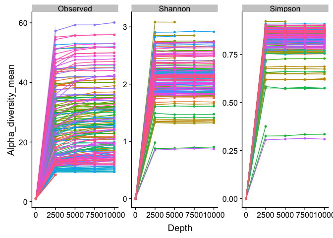

Divide the ps object for different dataset
------------------------------------------

### For taxonomy analysis based on "ps.REC.glom"

#### Taxonomy bar plot for individual values

``` r
TaxBar <- function(ps, var1, var2, lvl = NULL, lvl2 = NULL){
  ExpTaxa <- c("Bacillaceae","Bacillus","Corynebacterium","Clostridiaceae",
               "Clostridium","Enterococcus","Escherichia","Lactococcus",
               "Pseudomonas","Staphylococcus","Streptococcus") 
  
  ps <-  ps %>% transform_sample_counts(function(x) x/sum(x) )  
  TaxTab <- tax_table(ps) %>% as.data.frame()
  taxa_names(ps) <- TaxTab$REC 
  allTaxa <- taxa_names(ps)
  ps.other <- prune_taxa(allTaxa[!(allTaxa %in% ExpTaxa)], ps)
  taxa.other <- ps.other@tax_table[,7] %>% as.character() # 7 for REC level 
  
  # change the taxa that are not the expected taxa to "Other" 
  TaxTab2 <- psmelt(ps)
  # merge/average per Sample and CheeseOutcome
  TaxTab2_agg <- aggregate(Abundance ~ TaxTab2[[var1]] + TaxTab2[[var2]] + REC,
                           data = TaxTab2,
                           mean)
  colnames(TaxTab2_agg)[1] <- var1
  colnames(TaxTab2_agg)[2] <- var2
  TaxTab2_agg$REC <- as.character(TaxTab2_agg$REC)
  TaxTab2_agg[TaxTab2_agg$REC %in% taxa.other,]$REC <- "Other"
  
  # Set colors for plotting
  mycol = c("#a6cee3","#1f78b4","#b2df8a","#33a02c","#fb9a99","#e31a1c",
            "#fdbf6f","#ff7f00","#cab2d6","#6a3d9a","#ffff99","#b15928")
  
  # Set orders for taxonomy and sampleID
  TaxTab2_agg$REC = factor(TaxTab2_agg$REC, levels = c(ExpTaxa, "Other"))
  if (!is.null(lvl)) TaxTab2_agg[[var1]] <- factor(TaxTab2_agg[[var1]], levels = lvl)
  if (!is.null(lvl2)) TaxTab2_agg[[var2]] <- factor(TaxTab2_agg[[var2]], levels = lvl2)
  
  
  p <- ggplot(TaxTab2_agg, aes(x = get(var1), y = Abundance, fill = REC)) +
    facet_grid(. ~ get(var2), scales = "free_x") + 
    geom_bar(stat = "identity") + 
    scale_fill_manual(values = mycol)+
    theme_bw(base_size = 15)+
    guides(fill = guide_legend(reverse = FALSE, keywidth = 1, keyheight = 1)) +
    ylab("Relative proportion")
  
  # convert ggplot object to grob object
  gp <- ggplotGrob(p)
  # optional: take a look at the grob object's layout 
  # gtable::gtable_show_layout(gp)
  # get gtable columns corresponding to the facets 
  facet.columns <- gp$layout$l[grepl("panel", gp$layout$name)]
  # get the number of unique x-axis values per facet (1 & 3, in this case)
  x.var <- sapply(ggplot_build(p)$layout$panel_scales_x, 
                  function(l) length(l$range$range))
  # change the relative widths of the facet columns based on how many unique 
  # x-axis values are in each facet
  gp$widths[facet.columns] <- gp$widths[facet.columns] * x.var
  # plot result
  grid::grid.draw(gp)
}


# Plot for AVERAGE cell lysis method (ps1)(phase2, harsh cell lysis method)
## Take average of samples by catergory "For_AVE"
ps1.merge <- merge_samples(psList[[1]], "For_AVE", fun = mean)
## Repair the merged values associated with each surface after merge
sample_data(ps1.merge)$For_AVE <- levels(sample_data(psList[[1]])$For_AVE)
TaxBar(ps1.merge, var1 = "For_AVE", var2 = "Description",
       lvl = c("Expected","Bead_beating_6.5_2min","Bead_beating_6.5_1min",
               "Bead_beating_3.5_2min","Bead_beating_3.5_1min",
               "Vortex_15min","Vortex_10min","Chemical_20min"))


# Plot for AVERAGE PMA (ps3)
## Take average of samples by catergory "For_AVE"
ps3.merge <- merge_samples(psList[[3]], "For_AVE", fun = mean)
## Repair the merged values associated with each surface after merge
sample_data(ps3.merge)$For_AVE <- levels(sample_data(psList[[3]])$For_AVE)
## Fix Lysis with every 3rd row 
sample_data(ps3.merge)$Lysis <- sample_data(psList[[3]])[seq(1, nrow(sample_data(psList[[3]])), 3), ]$Lysis
sample_data(ps3.merge)$KIT <- sample_data(psList[[3]])[seq(3, nrow(sample_data(psList[[3]])), 3), ]$KIT
TaxBar(ps3.merge, var1 = "For_AVE", var2 = "SampleID",
       lvl = c("Expected","Total_Bead_beating_6.5_2min","Total_Vortex_NA","Total_Chemical_NA",
               "Core_Bead_beating_6.5_2min","Core_Vortex_","Core_Chemical_",
               "Ultra2_Bead_beating_6.5_2min","Ultra2_Vortex_","Ultra2_Chemical_"))


# Plot for PMA (ps4)
TaxBar(subset_samples(psList[[4]], SampleID != "Theo2.2" & SampleID != "Theo2.3"), 
       var1 = "SampleID", var2 = "For_AVE",
       lvl = c("Theo2.1", "MC.50.control.1","MC.live.control.1","MC.dead.control.1",
               "MC.live.1","Mc.live.2","MC.live.3","MC.50.1","MC.50.2","MC.50.3",
               "MC.dead.1","MC.dead.2","MC.dead.3"),
       lvl2 = c("Expected","Untreated","Live","Half","Dead"))
# Plot for AVERAGE PMA (ps4)
## Take average of samples by catergory "For_AVE"
ps4.merge <- merge_samples(psList[[4]], "For_AVE", fun = mean)
## Repair the merged values associated with each surface after merge
sample_data(ps4.merge)$For_AVE <- levels(sample_data(psList[[4]])$For_AVE)
TaxBar(ps4.merge,
       var1 = "For_AVE", var2 = "SampleID",
       lvl = c("Expected","Untreated","Live","Half","Dead"))

# Plot for sample storage conditions (ps5)
## BCMC2
TaxBar(subset_samples(psList[[5]], For_AVE %in% c("Glycerol","PBS2","Expected2")),  
       # subset to include only BCMC2 samples 
       var1 = "SampleID", var2 = "For_AVE",
       lvl = c("Theo2.1","Theo2.2","Theo2.3",
               "MC.PBS.1","MC.PBS.2","MC.PBS.3",
               "MC.25.glycerol.1","MC.25.glycerol.2","MC.25.glycerol.3"), 
       lvl2 = c("Expected2","PBS2", "Glycerol"))
## BCMC1
TaxBar(subset_samples(psList[[5]], For_AVE %in% c("Fresh","Freeze_Thaw","Expected1")),  
       # subset to include only BCMC1 samples 
       var1 = "SampleID", var2 = "For_AVE",
       lvl = c("Theo1.1","Theo1.2","Theo1.3",
               "IONMM1","IONMM2","IONMM3",
               "IONMM10","IONMM11","IONMM12"), 
       lvl2 = c("Expected1","Fresh", "Freeze_Thaw"))

# Plot for milk volumne collection (ps6)
TaxBar(subset_samples(psList[[6]], SampleID != "Theo2.2" & SampleID != "Theo2.3" &  
                        # subset to contain only one expected value
                        SampleID != "10TB.1" & SampleID != "10TB.2" & SampleID != "10TB.3"),
                        # subset to include only one set of 10ml samples
       var1 = "SampleID", var2 = "For_AVE",
       lvl = c("Theo2.1","MC.30ml.UHT.1","MC.30ml.UHT.2","MC.30ml.UHT.3",
               "MC.10ml.UHT.1","MC.10ml.UHT.2","MC.10ml.UHT.3",
               "MC.1ml.UHT.1","MC.1ml.UHT.2","MC.1ml.UHT.3","200TB.1","200TB.2","200TB.3"),
       lvl2 = c("Expected","30ml","10ml","1ml","200uL"))

# Plot for cell lysis (phase3, gentle DNA lysis) (ps7)
# Read in sample ID order 
lvl.ID <- read.csv(file.path("data/phase3_sample_orders.csv"), header = FALSE) 
lvl.ID$V1 <- as.character(lvl.ID$V1)
TaxBar(psList[[7]], var1 = "SampleID", var2 = "Kit", lvl = lvl.ID$V1)
TaxBar(psList[[7]], var1 = "SampleID", var2 = "Lysis", lvl = lvl.ID$V1, 
       lvl2 = c("Expected", "Bead beat: 2min x 6.5m/s", "Vortex: 15min", 
                "Chemical: 1hr", "Bead beat: 10s x 4m/s",
                "Chemical + Bead beat: 1hr + 10s x 4m/s",
                "Vortex: 30s", "Chemical + Vortex: 1hr + 30s "))
# Plot for ps7 average 
ps7.merge <- merge_samples(psList[[7]], "For_AVE", fun = mean)
sample_data(ps7.merge)$For_AVE <- levels(sample_data(psList[[7]])$For_AVE)
## Fix Lysis with every 3rd row 
sample_data(ps7.merge)$Lysis <- sample_data(psList[[7]])[seq(1, nrow(sample_data(psList[[7]])), 3), ]$Lysis
sample_data(ps7.merge)$Kit <- sample_data(psList[[7]])[seq(3, nrow(sample_data(psList[[7]])), 3), ]$Kit
TaxBar(ps7.merge, var1 = "For_AVE", var2 = "Lysis", 
       lvl = c("Expected","Total_Bead_beating_","Total_Bead_beating_Rnase_ammonium_acetate",
               "Total_Chemical_Bead_beating_","Total_Chemical_Bead_beating_Rnase_ammonium_acetate",
               "Total_Vortex_","Total_Vortex_Rnase_ammonium_acetate",
               "Total_Chemical_Vortex_","Total_Chemical_Vortex_Rnase_ammonium_acetate",
               "Microbiome_Bead_beating_","Microbiome_Bead_beating_Rnase_ammonium_acetate",
               "Microbiome_Chemical_Bead_beating_","Microbiome_Chemical_Bead_beating_Rnase_ammonium_acetate",
               "Microbiome_Vortex_","Microbiome_Vortex_Rnase_ammonium_acetate",
               "Microbiome_Chemical_Vortex_","Microbiome_Chemical_Vortex_Rnase_ammonium_acetate"), 
       lvl2 = c("Expected", "Bead beat: 2min x 6.5m/s", "Vortex: 15min", 
                "Chemical: 1hr", "Bead beat: 10s x 4m/s",
                "Chemical + Bead beat: 1hr + 10s x 4m/s",
                "Vortex: 30s", "Chemical + Vortex: 1hr + 30s "))
TaxBar(ps7.merge, var1 = "For_AVE", var2 = "Kit", 
       lvl = c("Expected","Total_Bead_beating_","Total_Bead_beating_Rnase_ammonium_acetate",
               "Total_Chemical_Bead_beating_","Total_Chemical_Bead_beating_Rnase_ammonium_acetate",
               "Total_Vortex_","Total_Vortex_Rnase_ammonium_acetate",
               "Total_Chemical_Vortex_","Total_Chemical_Vortex_Rnase_ammonium_acetate",
               "Microbiome_Bead_beating_","Microbiome_Bead_beating_Rnase_ammonium_acetate",
               "Microbiome_Chemical_Bead_beating_","Microbiome_Chemical_Bead_beating_Rnase_ammonium_acetate",
               "Microbiome_Vortex_","Microbiome_Vortex_Rnase_ammonium_acetate",
               "Microbiome_Chemical_Vortex_","Microbiome_Chemical_Vortex_Rnase_ammonium_acetate"), 
       lvl2 = c("Expected", "Total_phase3", "Total_ProteinaseK"))
```

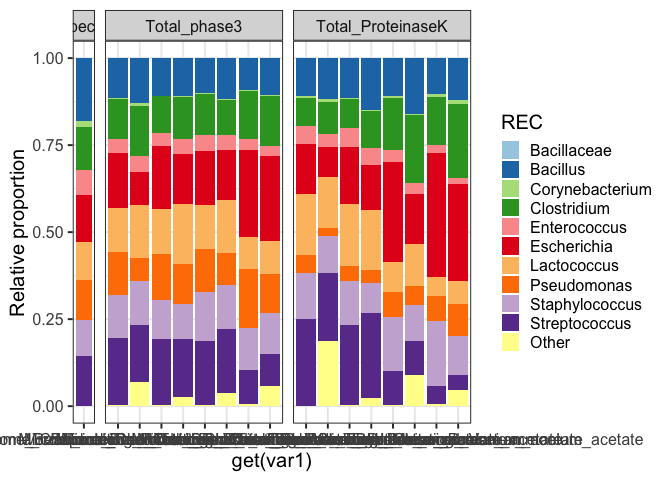

#### Taxonomy dot plot

The size of the dot is dependent on the relative proportion

``` r
TaxDot <- function(ps, var1, var2, lvl = NULL, lvl2 = NULL) {
  ExpTaxa <- c("Bacillaceae","Bacillus","Corynebacterium","Clostridiaceae",
               "Clostridium","Enterococcus","Escherichia","Lactococcus",
               "Pseudomonas","Staphylococcus","Streptococcus") 

  ps <-  ps %>% transform_sample_counts(function(x) x/sum(x) )  
  TaxTab <- tax_table(ps) %>% as.data.frame()
  taxa_names(ps) <- TaxTab$REC 
  allTaxa <- taxa_names(ps)
  ps.other <- prune_taxa(allTaxa[!(allTaxa %in% ExpTaxa)], ps)
  taxa.other <- ps.other@tax_table[,7] %>% as.character() # 7 for REC level 
  
  # change the taxa that are not the expected taxa to "Other" 
  TaxTab2 <- psmelt(ps)
  # merge/average per Sample and CheeseOutcome
  TaxTab2_agg <- aggregate(Abundance ~ TaxTab2[[var1]] + TaxTab2[[var2]] + REC,
                           data = TaxTab2,
                           mean)
  colnames(TaxTab2_agg)[1] <- var1
  colnames(TaxTab2_agg)[2] <- var2
  TaxTab2_agg$REC <- as.character(TaxTab2_agg$REC)
  TaxTab2_agg[TaxTab2_agg$REC %in% taxa.other,]$REC <- "Other"
  
  # Set orders for taxonomy and sampleID
  TaxTab2_agg$REC = factor(TaxTab2_agg$REC, levels = c("Other", rev(ExpTaxa)))
  if (!is.null(lvl)) TaxTab2_agg[[var1]] <- factor(TaxTab2_agg[[var1]], levels = lvl)
  if (!is.null(lvl2)) TaxTab2_agg[[var2]] <- factor(TaxTab2_agg[[var2]], levels = lvl2)
  
  # Set color scale
  colors = c("#8c510a", "#f6e8c3", "#01665e")

  
  print(ggplot(TaxTab2_agg, aes(x = get(var1), y = REC)) +
          geom_point(aes(size = Abundance, color = Abundance)) +
          scale_size(range = c(2, 8))+
          scale_color_gradient2(low = colors[1], high = colors[3], mid = colors[2],
                                midpoint = 0.2, limit = c(0, 0.4), 
                                space = "Lab",name = "Relative proportion") +
          facet_grid(. ~ get(var2), scales = "free_x") + 
          theme_bw(base_size = 15)+
          theme(axis.text.x = element_text(angle = 45, hjust = 1))) 
}

TaxDot(ps7.merge, var1 = "For_AVE", var2 = "Kit", 
       lvl = c("Expected","Total_Bead_beating_","Total_Bead_beating_Rnase_ammonium_acetate",
               "Total_Chemical_Bead_beating_","Total_Chemical_Bead_beating_Rnase_ammonium_acetate",
               "Total_Vortex_","Total_Vortex_Rnase_ammonium_acetate",
               "Total_Chemical_Vortex_","Total_Chemical_Vortex_Rnase_ammonium_acetate",
               "Microbiome_Bead_beating_","Microbiome_Bead_beating_Rnase_ammonium_acetate",
               "Microbiome_Chemical_Bead_beating_","Microbiome_Chemical_Bead_beating_Rnase_ammonium_acetate",
               "Microbiome_Vortex_","Microbiome_Vortex_Rnase_ammonium_acetate",
               "Microbiome_Chemical_Vortex_","Microbiome_Chemical_Vortex_Rnase_ammonium_acetate"),
       lvl2 = c("Expected", "Total_phase3", "Total_ProteinaseK"))
```

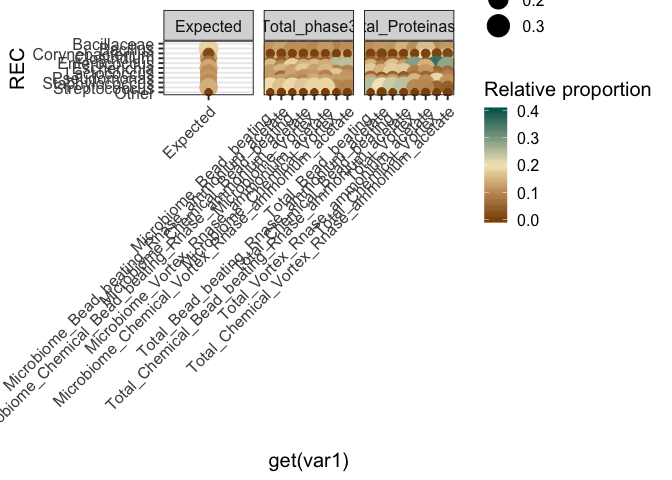

#### Fold change analysis compared to the expected

``` r
# relative abundance = (taxa - exp)/exp
FoldDot <- function(ps, var1, var2, lvl = NULL, lvl2 = NULL) {
  ps <-  ps %>% transform_sample_counts(function(x) x/sum(x) ) 
  TaxTab <- tax_table(ps) %>% as.data.frame()
  taxa_names(ps) <- TaxTab$REC
  
  # Subset to make new tax table 
  ExpTaxa <- c("Bacillus","Corynebacterium",
               "Clostridium","Enterococcus","Escherichia","Lactococcus",
               "Pseudomonas","Staphylococcus","Streptococcus") 
  TaxTab <- tax_table(ps) %>% as.data.frame()
  TaxTab <- subset(TaxTab, REC %in% ExpTaxa) # expected only
  ## add a row for "Other" taxa
  TaxTab <- rbind(TaxTab, data.frame(Kingdom = "Other",Phylum = "Other",
                                     Class = "Other",Order = "Other",
                                     Family = "Other", Genus = "Other",
                                     REC = "Other"))
  row.names(TaxTab)[row.names(TaxTab) == '1'] <- 'Other' # Change to "Other"
  TaxTab <- as.matrix(TaxTab)
  
  # Make new otu table based on relative abudance 
  df <- otu_table(ps) %>% t() %>% as.data.frame()
  df <- subset(df, row.names(df) %in% ExpTaxa) # expected only
  df <- rbind(df,  1-colSums(df[,1:ncol(df)])) # proportion of other bacteria
  row.names(df)[row.names(df) == '10'] <- 'Other' # Change to "Other"
  ## Calculate for relative difference
  df2 <- df[,1:ncol(df)] %>% mutate_all(funs(. - df[,"Expected"]))
  df2 <- select(df2, -Expected)
  row.names(df2) <- row.names(df)
  df3 <- df2[,1:ncol(df2)] %>% mutate_all(funs(. / df[,"Expected"]))
  row.names(df3) <- row.names(df)
  df3["Other",] <- df2["Other",] # replace Inf other with pre-division numbers
  df4 <- subset(df3, df3[,1] != Inf)
  
  # merge as new phyloseq object 
  ps <- phyloseq(otu_table(df4, taxa_are_rows = TRUE), sample_data(ps), tax_table(TaxTab))
  
  TaxTab2 <- psmelt(ps)
  # merge/average 
  TaxTab2_agg <- aggregate(Abundance ~ TaxTab2[[var1]] + TaxTab2[[var2]] + REC,
                           data = TaxTab2,
                           mean)
  colnames(TaxTab2_agg)[1] <- var1
  colnames(TaxTab2_agg)[2] <- var2
  # Set orders for taxonomy and sampleID
  TaxTab2_agg$REC = factor(TaxTab2_agg$REC, levels = c("Other",rev(ExpTaxa)))
  if (!is.null(lvl)) TaxTab2_agg[[var1]] <- factor(TaxTab2_agg[[var1]], levels = lvl)
  if (!is.null(lvl2)) TaxTab2_agg[[var2]] <- factor(TaxTab2_agg[[var2]], levels = lvl2)


  print(ggplot(TaxTab2_agg, aes(x = get(var1), y = REC)) +
          geom_point(aes(size = abs(Abundance), color = Abundance)) +
          scale_size(range = c(2, 8))+
          scale_color_gradientn(colors = colorRampPalette(c( "#B2182B", "#D6604D", 
                               "#FDDBC7", "#FFFFFF", "#D1E5F0", "#92C5DE",
                               "#4393C3", "#2166AC", "#053061"))(200)) + 
          facet_grid(. ~ get(var2), scales = "free_x") + 
          theme_bw(base_size = 15)+
          theme(axis.text.x = element_text(angle = 45, hjust = 1))) 
}

FoldDot(ps7.merge, var1 = "For_AVE", var2 = "Kit", 
        lvl = c("Expected","Total_Bead_beating_","Total_Bead_beating_Rnase_ammonium_acetate",
                 "Total_Chemical_Bead_beating_","Total_Chemical_Bead_beating_Rnase_ammonium_acetate",
                 "Total_Vortex_","Total_Vortex_Rnase_ammonium_acetate",
                 "Total_Chemical_Vortex_","Total_Chemical_Vortex_Rnase_ammonium_acetate",
                 "Microbiome_Bead_beating_","Microbiome_Bead_beating_Rnase_ammonium_acetate",
                 "Microbiome_Chemical_Bead_beating_","Microbiome_Chemical_Bead_beating_Rnase_ammonium_acetate",
                 "Microbiome_Vortex_","Microbiome_Vortex_Rnase_ammonium_acetate",
                 "Microbiome_Chemical_Vortex_","Microbiome_Chemical_Vortex_Rnase_ammonium_acetate"),
        lvl2 = c("Expected", "Total_phase3", "Total_ProteinaseK"))
```

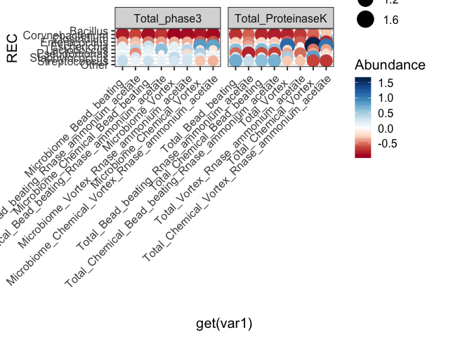

``` r
FoldDot(ps3.merge, var1 = "For_AVE", var2 = "KIT", 
        lvl = c("Total_Bead_beating_6.5_2min","Total_Vortex_NA","Total_Chemical_NA",
               "Core_Bead_beating_6.5_2min","Core_Vortex_","Core_Chemical_",
               "Ultra2_Bead_beating_6.5_2min","Ultra2_Vortex_","Ultra2_Chemical_"),
        lvl2 = c("Total", "Core","Ultra2"))
```

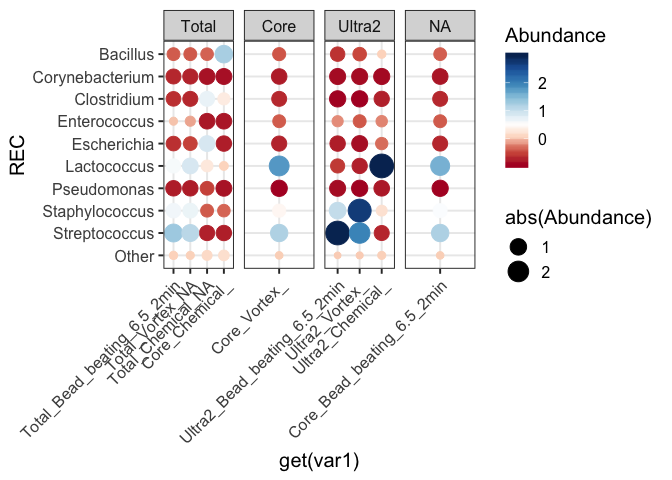

#### Fold change analysis compared to the B1

``` r
FoldB1Bar <- function(df) {

  ExpTaxa <- c("Bacillaceae","Bacillus","Corynebacterium","Clostridiales","Clostridiaceae",
               "Clostridium","Enterococcus","Escherichia","Enterobacteriaceae",
               "Lactococcus", "Pseudomonas","Staphylococcus","Streptococcus")
  # subset to contain expected taxa only
  df2 <- subset(t(df), row.names(t(df)) %in% c(ExpTaxa,"Method","SampleType"))
  df2 <- t(df2) %>% as.data.frame()
  dfm <- melt(df2, id.vars = c("Method","SampleType"),
              variable.name = "REC", value.name = "RelativeDiff")
  dfm$RelativeDiff <- as.numeric(dfm$RelativeDiff)

  # Set orders for taxonomy and sampleID
  dfm$REC = factor(dfm$REC, levels = ExpTaxa)
  dfm$SampleType <- factor(dfm$SampleType, levels = c("Mock","Milk"))

  print(
    ggbarplot(dfm, 
              x = "SampleType", y = "RelativeDiff", color = "Method", fill = "Method", 
              facet.by = "REC", scale = "free_y",
              palette = "jco", 
              merge =  "asis", # Set bar side by side instead of stacked
              add = c("mean_se"), position = position_dodge(0.8)))
}

RelDiffB1 <- read.csv(file.path("data/FeatTab_RelDiff_B1.csv"))
FoldB1Bar(RelDiffB1)
```

    ## Warning: attributes are not identical across measure variables; they will
    ## be dropped

    ## Warning: Ignoring unknown parameters: scale

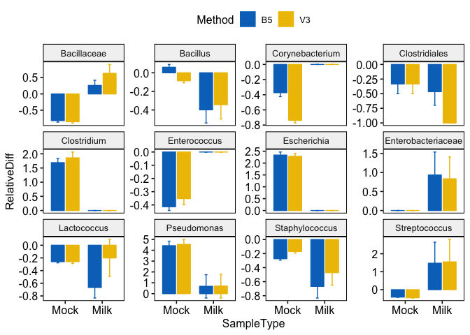

#### DESeq2 analysis

``` r
# calculate geometric means prior to estimate size factors
gmMean = function(x, na.rm=TRUE){
  exp(sum(log(x[x > 0]), na.rm=na.rm) / length(x))
}

# Define function for harsh cell lysis method (ps1)
HarshLyseDA <- function(ps, path.out) {
  sample_data(ps)$For_AVE <- factor(sample_data(ps)$For_AVE)
  psdds <- phyloseq_to_deseq2(ps, design = ~ For_AVE)
  geoMeans <- apply(counts(psdds), 1, gmMean)
  psdds <- estimateSizeFactors(psdds, geoMeans = geoMeans)
  
  dds <- DESeq(psdds, test = "Wald", fitType = "local") 
  plotDispEsts(dds, ylim = c(1e-6, 1e2)) 
  alpha <- 0.1 #  padj for indepenent filtering and expect FDR < alpha
  resB1 <- results(dds, contrast = c("For_AVE", "Expected", "Bead_beating_6.5_2min"),
                   alpha = alpha, lfcThreshold = log2(1.5), altHypothesis = "greaterAbs")
  resB2 <- results(dds, contrast = c("For_AVE", "Expected", "Bead_beating_6.5_1min"),
                    alpha = alpha, lfcThreshold = log2(1.5), altHypothesis = "greaterAbs")
  resB3<- results(dds, contrast = c("For_AVE", "Expected", "Bead_beating_3.5_2min"),
                     alpha = alpha, lfcThreshold = log2(1.5), altHypothesis = "greaterAbs")
  resB4 <- results(dds, contrast = c("For_AVE", "Expected", "Bead_beating_3.5_1min"),
                      alpha = alpha, lfcThreshold = log2(1.5), altHypothesis = "greaterAbs")
  resV1 <- results(dds, contrast = c("For_AVE", "Expected", "Vortex_15min"),
                   alpha = alpha, lfcThreshold = log2(1.5), altHypothesis = "greaterAbs")
  resV2 <- results(dds, contrast = c("For_AVE", "Expected", "Vortex_10min"),
                    alpha = alpha, lfcThreshold = log2(1.5), altHypothesis = "greaterAbs")
  resC1 <- results(dds, contrast = c("For_AVE", "Expected", "Chemical_20min"),
                     alpha = alpha, lfcThreshold = log2(1.5), altHypothesis = "greaterAbs")
  
  f <- function(res){
    mcols(res, use.names = TRUE)
    sigtab <- res[which(res$padj < alpha), ]
    cbind(as(sigtab, "data.frame"), as(tax_table(ps)[rownames(sigtab), ], "matrix"))
  }
  
  sigtabB1 <- f(resB1)
  sigtabB2 <- f(resB2)
  sigtabB3 <- f(resB3)
  sigtabB4 <- f(resB4)
  sigtabV1 <- f(resV1)
  sigtabV2 <- f(resV2)
  sigtabC1 <- f(resC1)
  
  dir.create(path.out, recursive = TRUE)
  if (nrow(resB1) > 0) write.csv(sigtabB1, file.path(path.out, "sigtabB1.csv"))
  if (nrow(resB2) > 0) write.csv(sigtabB2, file.path(path.out, "sigtabB2.csv"))
  if (nrow(resB3) > 0) write.csv(sigtabB3, file.path(path.out, "sigtabB3.csv"))
  if (nrow(resB4) > 0) write.csv(sigtabB4, file.path(path.out, "sigtabB4.csv"))
  if (nrow(resV1) > 0) write.csv(sigtabV1, file.path(path.out, "sigtabV1.csv"))
  if (nrow(resV2) > 0) write.csv(sigtabV2, file.path(path.out, "sigtabV2.csv"))
  if (nrow(resC1) > 0) write.csv(sigtabC1, file.path(path.out, "sigtabC1.csv"))
}

HarshLyseDA(psList[[1]], path.out = file.path("DESeq2_restab/HarshLyse"))
```

    ## converting counts to integer mode

    ## using pre-existing size factors

    ## estimating dispersions

    ## gene-wise dispersion estimates

    ## mean-dispersion relationship

    ## final dispersion estimates

    ## fitting model and testing

    ## Warning in dir.create(path.out, recursive = TRUE): 'DESeq2_restab/
    ## HarshLyse' already exists

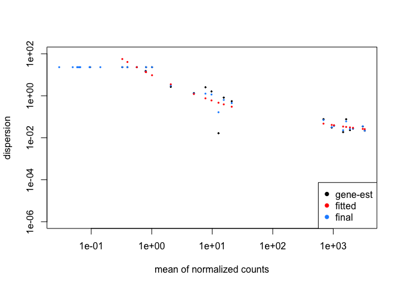

``` r
# Define function for 3 different kits (Total, Core, Ultra2)
KitDA <- function(ps, path.out) {
  sample_data(ps)$LYSING <- factor(sample_data(ps)$LYSING)
  psdds <- phyloseq_to_deseq2(ps, design = ~ LYSING)
  geoMeans <- apply(counts(psdds), 1, gmMean)
  psdds <- estimateSizeFactors(psdds, geoMeans = geoMeans)
  
  dds <- DESeq(psdds, test = "Wald", fitType = "local") 
  plotDispEsts(dds, ylim = c(1e-6, 1e2)) 
  alpha <- 0.1 #  padj for indepenent filtering and expect FDR < alpha
  resB1 <- results(dds, contrast = c("LYSING", "Theoretical_value", "Bead_beating"),
                   alpha = alpha, lfcThreshold = log2(1.5), altHypothesis = "greaterAbs")
  resV1 <- results(dds, contrast = c("LYSING", "Theoretical_value", "Vortex"),
                   alpha = alpha, lfcThreshold = log2(1.5), altHypothesis = "greaterAbs")
  resC1 <- results(dds, contrast = c("LYSING", "Theoretical_value", "Chemical"),
                   alpha = alpha, lfcThreshold = log2(1.5), altHypothesis = "greaterAbs")
  
  f <- function(res){
    mcols(res, use.names = TRUE)
    sigtab <- res[which(res$padj < alpha), ]
    cbind(as(sigtab, "data.frame"), as(tax_table(ps)[rownames(sigtab), ], "matrix"))
  }
  
  sigtabB1 <- f(resB1)
  sigtabV1 <- f(resV1)
  sigtabC1 <- f(resC1)
  
  dir.create(path.out, recursive = TRUE)
  if (nrow(resB1) > 0){
    write.csv(sigtabB1, file.path(path.out, "sigtabB1.csv"))
  }
  if (nrow(resV1) > 0){
    write.csv(sigtabV1, file.path(path.out, "sigtabV1.csv"))
  }
  if (nrow(resC1) > 0){
    write.csv(sigtabC1, file.path(path.out, "sigtabsC1.csv"))
  }
}

# Total kit
KitDA(subset_samples(psList[[3]], KIT %in% c("Total","Expected")),
      path.out = file.path("DESeq2_restab/Kit/Total"))
```

    ## converting counts to integer mode

    ## using pre-existing size factors

    ## estimating dispersions

    ## gene-wise dispersion estimates

    ## mean-dispersion relationship

    ## final dispersion estimates

    ## fitting model and testing

    ## Warning in dir.create(path.out, recursive = TRUE): 'DESeq2_restab/Kit/
    ## Total' already exists

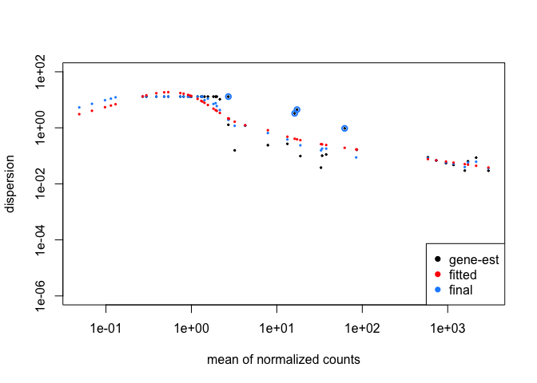

``` r
# Core kit
KitDA(subset_samples(psList[[3]], KIT %in% c("Core","Expected")),
      path.out = file.path("DESeq2_restab/Kit/Core"))
```

    ## converting counts to integer mode

    ## using pre-existing size factors

    ## estimating dispersions

    ## gene-wise dispersion estimates

    ## mean-dispersion relationship

    ## final dispersion estimates

    ## fitting model and testing

    ## Warning in dir.create(path.out, recursive = TRUE): 'DESeq2_restab/Kit/Core'
    ## already exists

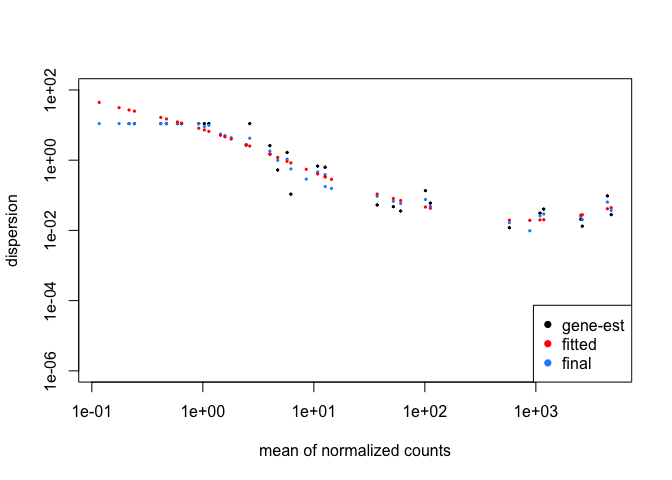

``` r
# Ultra2 kit
KitDA(subset_samples(psList[[3]], KIT %in% c("Ultra2","Expected")),
      path.out = file.path("DESeq2_restab/Kit/Ultra2"))
```

    ## converting counts to integer mode

    ## using pre-existing size factors

    ## estimating dispersions

    ## gene-wise dispersion estimates

    ## mean-dispersion relationship

    ## final dispersion estimates

    ## fitting model and testing

    ## Warning in dir.create(path.out, recursive = TRUE): 'DESeq2_restab/Kit/
    ## Ultra2' already exists

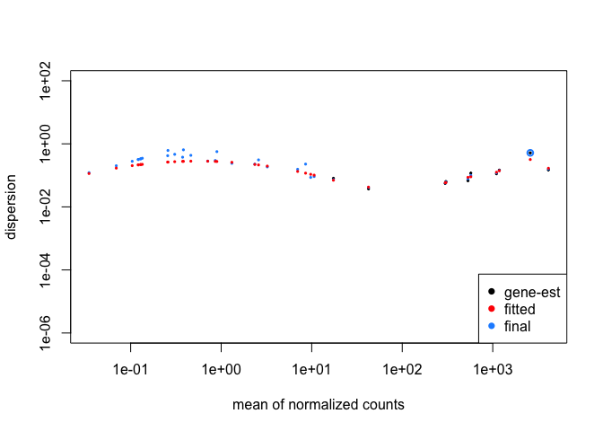

``` r
# Define function for PMA differential abundance
PMADA <- function(ps, path.out) {
  sample_data(ps)$For_AVE <- factor(sample_data(ps)$For_AVE)
  psdds <- phyloseq_to_deseq2(ps, design = ~ For_AVE)
  geoMeans <- apply(counts(psdds), 1, gmMean)
  psdds <- estimateSizeFactors(psdds, geoMeans = geoMeans)
  
  dds <- DESeq(psdds, test = "Wald", fitType = "local") 
  plotDispEsts(dds, ylim = c(1e-6, 1e2)) 
  alpha <- 0.1 #  padj for indepenent filtering and expect FDR < alpha
  resUn <- results(dds, contrast = c("For_AVE", "Expected", "Untreated"),
                   alpha = alpha, lfcThreshold = log2(1.5), altHypothesis = "greaterAbs")
  resLi <- results(dds, contrast = c("For_AVE", "Expected", "Live"),
                   alpha = alpha, lfcThreshold = log2(1.5), altHypothesis = "greaterAbs")
  resHa <- results(dds, contrast = c("For_AVE", "Expected", "Half"),
                   alpha = alpha, lfcThreshold = log2(1.5), altHypothesis = "greaterAbs")
  resDe <- results(dds, contrast = c("For_AVE", "Expected", "Dead"),
                   alpha = alpha, lfcThreshold = log2(1.5), altHypothesis = "greaterAbs")
  resULi <- results(dds, contrast = c("For_AVE", "Untreated", "Live"),
                    alpha = alpha, lfcThreshold = log2(1.5), altHypothesis = "greaterAbs")
  resUHa <- results(dds, contrast = c("For_AVE", "Untreated", "Half"),
                    alpha = alpha, lfcThreshold = log2(1.5), altHypothesis = "greaterAbs")
  resUDe <- results(dds, contrast = c("For_AVE", "Untreated", "Dead"),
                    alpha = alpha, lfcThreshold = log2(1.5), altHypothesis = "greaterAbs")
  
  f <- function(res){
    mcols(res, use.names = TRUE)
    sigtab <- res[which(res$padj < alpha), ]
    cbind(as(sigtab, "data.frame"), as(tax_table(ps)[rownames(sigtab), ], "matrix"))
  }
  
  sigtabUn <- f(resUn)
  sigtabLi <- f(resLi)
  sigtabHa <- f(resHa)
  sigtabDe <- f(resDe)
  sigtabULi <- f(resULi)
  sigtabUHa <- f(resUHa)
  sigtabUDe <- f(resUDe)
  
  dir.create(path.out, recursive = TRUE)
  if (nrow(resUn) > 0){
    write.csv(resUn, file.path(path.out, "resUn.csv"))
  }
  if (nrow(resLi) > 0){
    write.csv(resLi, file.path(path.out, "resLi.csv"))
  }
  if (nrow(resHa) > 0){
    write.csv(resHa, file.path(path.out, "resHa.csv"))
  }
  if (nrow(resDe) > 0){
    write.csv(resDe, file.path(path.out, "resDe.csv"))
  }
  if (nrow(resULi) > 0){
    write.csv(resULi, file.path(path.out, "resULi.csv"))
  }
  if (nrow(resUHa) > 0){
    write.csv(resUHa, file.path(path.out, "resUHa.csv"))
  }
  if (nrow(resUDe) > 0){
    write.csv(resUDe, file.path(path.out, "resUDe.csv"))
  }  
}

PMADA(psList[[4]], path.out = file.path("DESeq2_restab/PMA"))
```

    ## converting counts to integer mode

    ## using pre-existing size factors

    ## estimating dispersions

    ## gene-wise dispersion estimates

    ## mean-dispersion relationship

    ## final dispersion estimates

    ## fitting model and testing

    ## Warning in dir.create(path.out, recursive = TRUE): 'DESeq2_restab/PMA'
    ## already exists

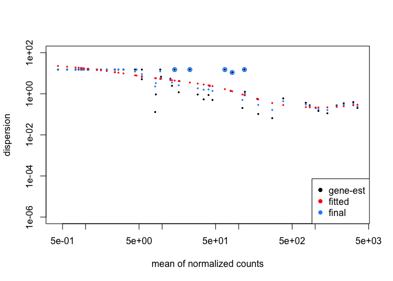

``` r
# Define function for Gentle cell lysis methods (ps7)
Phase3DA <- function(ps, path.out) {
  sample_data(ps)$For_AVE <- factor(sample_data(ps)$For_AVE)
  psdds <- phyloseq_to_deseq2(ps, design = ~ For_AVE)
  geoMeans <- apply(counts(psdds), 1, gmMean)
  psdds <- estimateSizeFactors(psdds, geoMeans = geoMeans)
  
  dds <- DESeq(psdds, test = "Wald", fitType = "local") 
  plotDispEsts(dds, ylim = c(1e-6, 1e2)) 
  alpha <- 0.1 #  padj for indepenent filtering and expect FDR < alpha
  resB5 <- results(dds, contrast = c("For_AVE", "Expected", "Total_Bead_beating_"),
                   alpha = alpha, lfcThreshold = log2(1.5), altHypothesis = "greaterAbs")
  resB5R <- results(dds, contrast = c("For_AVE", "Expected", "Total_Bead_beating_Rnase_ammonium_acetate"),
                    alpha = alpha, lfcThreshold = log2(1.5), altHypothesis = "greaterAbs")
  resC2B5 <- results(dds, contrast = c("For_AVE", "Expected", "Total_Chemical_Bead_beating_"),
                     alpha = alpha, lfcThreshold = log2(1.5), altHypothesis = "greaterAbs")
  resC2B5R <- results(dds, contrast = c("For_AVE", "Expected", "Total_Chemical_Bead_beating_Rnase_ammonium_acetate"),
                      alpha = alpha, lfcThreshold = log2(1.5), altHypothesis = "greaterAbs")
  resV3 <- results(dds, contrast = c("For_AVE", "Expected", "Total_Vortex_"),
                   alpha = alpha, lfcThreshold = log2(1.5), altHypothesis = "greaterAbs")
  resV3R <- results(dds, contrast = c("For_AVE", "Expected", "Total_Vortex_Rnase_ammonium_acetate"),
                    alpha = alpha, lfcThreshold = log2(1.5), altHypothesis = "greaterAbs")
  resC2V3 <- results(dds, contrast = c("For_AVE", "Expected", "Total_Chemical_Vortex_"),
                     alpha = alpha, lfcThreshold = log2(1.5), altHypothesis = "greaterAbs")
  resC2V3R <- results(dds, contrast = c("For_AVE", "Expected", "Total_Chemical_Vortex_Rnase_ammonium_acetate"),
                      alpha = alpha, lfcThreshold = log2(1.5), altHypothesis = "greaterAbs")
  resB5P <- results(dds, contrast = c("For_AVE", "Expected", "Microbiome_Bead_beating_"),
                    alpha = alpha, lfcThreshold = log2(1.5), altHypothesis = "greaterAbs")
  resB5RP <- results(dds, contrast = c("For_AVE", "Expected", "Microbiome_Bead_beating_Rnase_ammonium_acetate"),
                     alpha = alpha, lfcThreshold = log2(1.5), altHypothesis = "greaterAbs")
  resC2B5P <- results(dds, contrast = c("For_AVE", "Expected", "Microbiome_Chemical_Bead_beating_"),
                      alpha = alpha, lfcThreshold = log2(1.5), altHypothesis = "greaterAbs")
  resC2B5RP <- results(dds, contrast = c("For_AVE", "Expected", "Microbiome_Chemical_Bead_beating_Rnase_ammonium_acetate"),
                       alpha = alpha, lfcThreshold = log2(1.5), altHypothesis = "greaterAbs")
  resV3P <- results(dds, contrast = c("For_AVE", "Expected", "Microbiome_Vortex_"),
                    alpha = alpha, lfcThreshold = log2(1.5), altHypothesis = "greaterAbs")
  resV3RP <- results(dds, contrast = c("For_AVE", "Expected", "Microbiome_Vortex_Rnase_ammonium_acetate"),
                     alpha = alpha, lfcThreshold = log2(1.5), altHypothesis = "greaterAbs")
  resC2V3P <- results(dds, contrast = c("For_AVE", "Expected", "Microbiome_Chemical_Vortex_"),
                      alpha = alpha, lfcThreshold = log2(1.5), altHypothesis = "greaterAbs")
  resC2V3RP <- results(dds, contrast = c("For_AVE", "Expected", "Microbiome_Chemical_Vortex_Rnase_ammonium_acetate"),
                       alpha = alpha, lfcThreshold = log2(1.5), altHypothesis = "greaterAbs")
  
  f <- function(res){
    mcols(res, use.names = TRUE)
    sigtab <- res[which(res$padj < alpha), ]
    cbind(as(sigtab, "data.frame"), as(tax_table(ps)[rownames(sigtab), ], "matrix"))
  }
  
  sigtabB5 <- f(resB5)
  sigtabB5R <- f(resB5R)
  sigtabC2B5 <- f(resC2B5)
  sigtabC2B5R <- f(resC2B5R)
  sigtabV3 <- f(resV3)
  sigtabV3R <- f(resV3R) 
  sigtabC2V3 <- f(resC2V3)
  sigtabC2V3R <- f(resC2V3R)
  sigtabB5P <- f(resB5P) 
  sigtabB5RP <- f(resB5RP)
  sigtabC2B5P <- f(resC2B5P)
  sigtabC2B5RP <- f(resC2B5RP) 
  sigtabV3P <- f(resV3P)
  sigtabV3RP <- f(resV3RP)
  sigtabC2V3P <- f(resC2V3P)   
  sigtabC2V3RP <- f(resC2V3RP)  
  
  dir.create(path.out, recursive = TRUE)
  if (nrow(resB5) > 0) write.csv(sigtabB5, file.path(path.out, "sigtabB5.csv"))
  if (nrow(resB5R) > 0) write.csv(sigtabB5R, file.path(path.out, "sigtabB5R.csv"))
  if (nrow(resC2B5) > 0) write.csv(sigtabC2B5, file.path(path.out, "sigtabC2B5.csv"))
  if (nrow(resC2B5R) > 0) write.csv(sigtabC2B5R, file.path(path.out, "sigtabC2B5R.csv"))
  if (nrow(resV3) > 0) write.csv(sigtabV3, file.path(path.out, "sigtabV3.csv"))
  if (nrow(resV3R) > 0) write.csv(sigtabV3R, file.path(path.out, "sigtabV3R.csv"))
  if (nrow(resC2V3) > 0) write.csv(sigtabC2V3, file.path(path.out, "sigtabC2V3.csv"))
  if (nrow(resC2V3R) > 0) write.csv(sigtabC2V3R, file.path(path.out, "sigtabC2V3R.csv"))
  if (nrow(resB5P) > 0) write.csv(sigtabB5P, file.path(path.out, "sigtabB5P.csv"))
  if (nrow(resB5RP) > 0) write.csv(sigtabB5RP, file.path(path.out, "sigtabB5RP.csv"))
  if (nrow(resC2B5P) > 0) write.csv(sigtabC2B5P, file.path(path.out, "sigtabC2B5P.csv"))
  if (nrow(resC2B5RP) > 0) write.csv(sigtabC2B5RP, file.path(path.out, "sigtabC2B5RP.csv"))
  if (nrow(resV3P) > 0) write.csv(sigtabV3P, file.path(path.out, "sigtabV3P.csv"))
  if (nrow(resV3RP) > 0) write.csv(sigtabV3RP, file.path(path.out, "sigtabV3RP.csv"))
  if (nrow(resC2V3P) > 0) write.csv(sigtabC2V3P, file.path(path.out, "sigtabC2V3P.csv"))
  if (nrow(resC2V3RP) > 0) write.csv(sigtabC2V3RP, file.path(path.out, "sigtabC2V3RP.csv"))
}

Phase3DA(psList[[7]], path.out = file.path("DESeq2_restab/phase3"))
```

    ## converting counts to integer mode

    ## using pre-existing size factors

    ## estimating dispersions

    ## gene-wise dispersion estimates

    ## mean-dispersion relationship

    ## final dispersion estimates

    ## fitting model and testing

    ## Warning in dir.create(path.out, recursive = TRUE): 'DESeq2_restab/phase3'
    ## already exists

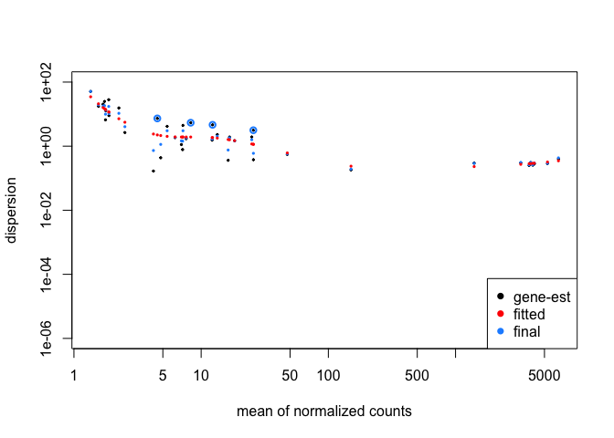

### For alpha and beta div based on ps.REC.glom after rarefaction (ps.REC.glom.rare)

I did not use ps.Phy05 for beta because the expected ASV is not the same as the actual sequenced ASV. If use ps.Phy05, the Bray distance of samples from expected would all be 1 (doesn't share any common species). The assumption is that the taxa assignment is accurate until Genus. Therefore, for alpha diversity, I would also use ps.REC.glom to keep until Genus level.

``` r
ps.glom.rare <-  rarefy_even_depth(ps.REC.glom, sample.size = 3990, 
                                   replace = TRUE, rngseed = 123 , 
                                   trimOTUs = TRUE, verbose = TRUE)
```

    ## `set.seed(123)` was used to initialize repeatable random subsampling.

    ## Please record this for your records so others can reproduce.

    ## Try `set.seed(123); .Random.seed` for the full vector

    ## ...

    ## 9 samples removedbecause they contained fewer reads than `sample.size`.

    ## Up to first five removed samples are:

    ## milliQ.110CB.NC10TB.NC10TC.NC10UB.1  

    ## ...

``` r
# Divide the phyloseq objects up 
psList.rare <- list()
for (i in 1:8){
  psList.rare[[i]] <- phyloseq(sample_data(samdfList[[i]]), otu_table(ps.glom.rare),
                               tax_table(ps.glom.rare), phy_tree(ps.glom.rare))
  print(psList.rare[[i]] )
}
```

    ## phyloseq-class experiment-level object
    ## otu_table()   OTU Table:         [ 100 taxa and 23 samples ]
    ## sample_data() Sample Data:       [ 23 samples by 13 sample variables ]
    ## tax_table()   Taxonomy Table:    [ 100 taxa by 7 taxonomic ranks ]
    ## phy_tree()    Phylogenetic Tree: [ 100 tips and 99 internal nodes ]
    ## phyloseq-class experiment-level object
    ## otu_table()   OTU Table:         [ 100 taxa and 6 samples ]
    ## sample_data() Sample Data:       [ 6 samples by 13 sample variables ]
    ## tax_table()   Taxonomy Table:    [ 100 taxa by 7 taxonomic ranks ]
    ## phy_tree()    Phylogenetic Tree: [ 100 tips and 99 internal nodes ]
    ## phyloseq-class experiment-level object
    ## otu_table()   OTU Table:         [ 100 taxa and 29 samples ]
    ## sample_data() Sample Data:       [ 29 samples by 13 sample variables ]
    ## tax_table()   Taxonomy Table:    [ 100 taxa by 7 taxonomic ranks ]
    ## phy_tree()    Phylogenetic Tree: [ 100 tips and 99 internal nodes ]
    ## phyloseq-class experiment-level object
    ## otu_table()   OTU Table:         [ 100 taxa and 15 samples ]
    ## sample_data() Sample Data:       [ 15 samples by 13 sample variables ]
    ## tax_table()   Taxonomy Table:    [ 100 taxa by 7 taxonomic ranks ]
    ## phy_tree()    Phylogenetic Tree: [ 100 tips and 99 internal nodes ]
    ## phyloseq-class experiment-level object
    ## otu_table()   OTU Table:         [ 100 taxa and 24 samples ]
    ## sample_data() Sample Data:       [ 24 samples by 13 sample variables ]
    ## tax_table()   Taxonomy Table:    [ 100 taxa by 7 taxonomic ranks ]
    ## phy_tree()    Phylogenetic Tree: [ 100 tips and 99 internal nodes ]
    ## phyloseq-class experiment-level object
    ## otu_table()   OTU Table:         [ 100 taxa and 18 samples ]
    ## sample_data() Sample Data:       [ 18 samples by 12 sample variables ]
    ## tax_table()   Taxonomy Table:    [ 100 taxa by 7 taxonomic ranks ]
    ## phy_tree()    Phylogenetic Tree: [ 100 tips and 99 internal nodes ]
    ## phyloseq-class experiment-level object
    ## otu_table()   OTU Table:         [ 100 taxa and 51 samples ]
    ## sample_data() Sample Data:       [ 51 samples by 17 sample variables ]
    ## tax_table()   Taxonomy Table:    [ 100 taxa by 7 taxonomic ranks ]
    ## phy_tree()    Phylogenetic Tree: [ 100 tips and 99 internal nodes ]
    ## phyloseq-class experiment-level object
    ## otu_table()   OTU Table:         [ 100 taxa and 10 samples ]
    ## sample_data() Sample Data:       [ 10 samples by 8 sample variables ]
    ## tax_table()   Taxonomy Table:    [ 100 taxa by 7 taxonomic ranks ]
    ## phy_tree()    Phylogenetic Tree: [ 100 tips and 99 internal nodes ]

``` r
# Define function to get distance matrix (not include unifrac)
# I have to use distance() from vegan packages due to in compatibility 
# https://github.com/joey711/phyloseq/issues/918
DistTab <- function(ps, DistMethod){
  df <- psmelt(ps)
  df.cast <- dcast(df, For_AVE + SampleID ~ OTU, value.var = "Abundance")
  df.cast <- df.cast[,-1]
  row.names(df.cast) <- df.cast[,1]
  df.cast <- df.cast[,-1]
  dist <- vegdist(df.cast, method = DistMethod) %>% as.matrix()
}


# use the function to write bray distance list and write out as csv files
BrayList <- lapply(psList.rare, DistTab, DistMethod = "bray")
names(BrayList) <- c(1:8)
dir.create("distance/bray", recursive = TRUE)
```

    ## Warning in dir.create("distance/bray", recursive = TRUE): 'distance/bray'
    ## already exists

``` r
mapply(write.csv, BrayList, file = paste0("distance/bray/", names(BrayList), ".csv"))
```

    ## $`1`
    ## NULL
    ## 
    ## $`2`
    ## NULL
    ## 
    ## $`3`
    ## NULL
    ## 
    ## $`4`
    ## NULL
    ## 
    ## $`5`
    ## NULL
    ## 
    ## $`6`
    ## NULL
    ## 
    ## $`7`
    ## NULL
    ## 
    ## $`8`
    ## NULL

``` r
# write out weighted list as well
WeightList <- lapply(psList.rare, UniFrac, weighted = TRUE)
WeightList <- lapply(WeightList, as.matrix)
names(WeightList) <- c(1:8)
dir.create("distance/weighted", recursive = TRUE)
```

    ## Warning in dir.create("distance/weighted", recursive = TRUE): 'distance/
    ## weighted' already exists

``` r
mapply(write.csv, WeightList, file = paste0("distance/weighted/", names(WeightList), ".csv"))
```

    ## $`1`
    ## NULL
    ## 
    ## $`2`
    ## NULL
    ## 
    ## $`3`
    ## NULL
    ## 
    ## $`4`
    ## NULL
    ## 
    ## $`5`
    ## NULL
    ## 
    ## $`6`
    ## NULL
    ## 
    ## $`7`
    ## NULL
    ## 
    ## $`8`
    ## NULL

``` r
# Import organized and subsetted (only extraction) distance csv file for making bar plots
# Define function to make box plot and add p-values to the plot 
## based on the package called "ggpubr"
DistBox <- function(df, DistMethod,lvl,facet.variable = NULL,ref = NULL,comp=NULL) {
  df$Description <- factor(df$Description, levels = lvl)
  df$Kit <- factor(df$Kit, levels = c("Total","Core","Ultra2",
                                      "Total_phase3", "Total_ProteinaseK"))
  df$Lysis <- factor(df$Lysis,
                     levels = c("Bead beat: 2min x 6.5m/s", "Vortex: 15min",
                                "Chemical: 1hr", "Bead beat: 10s x 4m/s",
                                "Chemical + Bead beat: 1hr + 10s x 4m/s",
                                "Vortex: 30s", "Chemical + Vortex: 1hr + 30s "))
  
  (ggboxplot(df, x = "Description", y = "ave", ylab = DistMethod,add = "jitter",
             fill = "Lysis", palette = "Set3", facet.by = facet.variable,
             short.panel.labs = FALSE, 
             font.label = list(size = 18, face = "plain"),
             ggtheme = theme_bw()) + 
     stat_compare_means(method = "t.test", ref.group = ref, comparisons = comp,
                        hide.ns = FALSE,  label = "p.signif")) %>% print
  
  # ns: p > 0.05
  # *: p <= 0.05
  # **: p <= 0.01
  # ***: p <= 0.001
  # ****: p <= 0.0001
}


# Plot for ps3
## DNA extraction using 3 kits (Total, Core, Ultra)
Bray.3kits <- read.csv(file.path("distance/organized_bray_3_3kits.csv"))
DistBox(Bray.3kits, DistMethod = "Bray-Curtis dissimilarity",
        lvl = c("Total_Bead_beating_6.5_2min","Total_Vortex_NA","Total_Chemical_NA",
                "Core_Bead_beating_6.5_2min","Core_Vortex_","Core_Chemical_",
                "Ultra2_Bead_beating_6.5_2min","Ultra2_Vortex_","Ultra2_Chemical_"),
        ref = "Total_Bead_beating_6.5_2min")
```

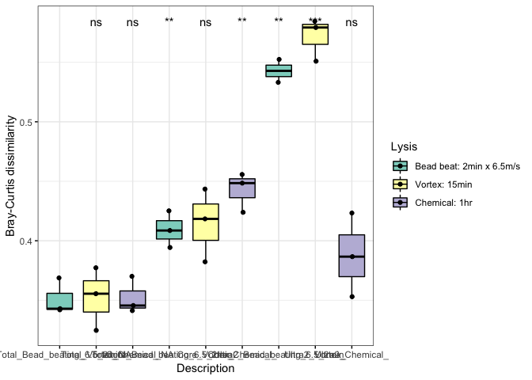

``` r
weighted.3kits <- read.csv(file.path("distance/organized_weighted_3_3kits.csv"))
DistBox(weighted.3kits, DistMethod = "Weighted UniFrac distance",
        lvl = c("Total_Bead_beating_6.5_2min","Total_Vortex_NA","Total_Chemical_NA",
                "Core_Bead_beating_6.5_2min","Core_Vortex_","Core_Chemical_",
                "Ultra2_Bead_beating_6.5_2min","Ultra2_Vortex_","Ultra2_Chemical_"),
        ref = "Total_Bead_beating_6.5_2min")
```

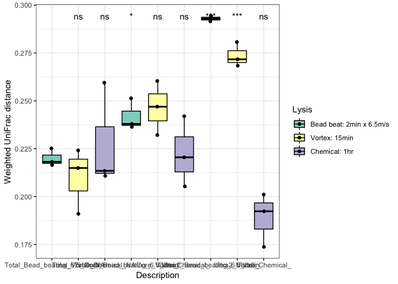

``` r
# Plot for ps7
## DNA extration from Phase 3 (distance from the expected value)
Bray.ext <- read.csv(file.path("distance/organized_distance_extraction_bray.csv"))
DistBox(Bray.ext, DistMethod = "Bray-Curtis dissimilarity",
        lvl = c("10TB", "10TV", "10TC", "10CB", "10CV", "10CC", 
                "10UB", "10UV", "10UC", "M4W","M4R","ML4W",
                "ML4R","MVW","MVR","MLVW","MLVR", "P4W","P4R",
                "PL4W","PL4R","PVW","PVR","PLVW","PLVR"),
        ref = "10TB")
```

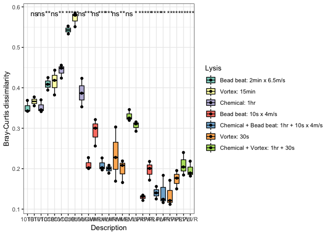

``` r
weighted.ext <- read.csv(file.path("distance/organized_distance_extraction_weighted.csv"))
DistBox(weighted.ext, DistMethod = "Weighted UniFrac distance",
        lvl = c("10TB", "10TV", "10TC", "10CB", "10CV", "10CC", 
                "10UB", "10UV", "10UC", "M4W","M4R","ML4W",
                "ML4R","MVW","MVR","MLVW","MLVR", "P4W","P4R",
                "PL4W","PL4R","PVW","PVR","PLVW","PLVR"),
        ref = "10TB")
```

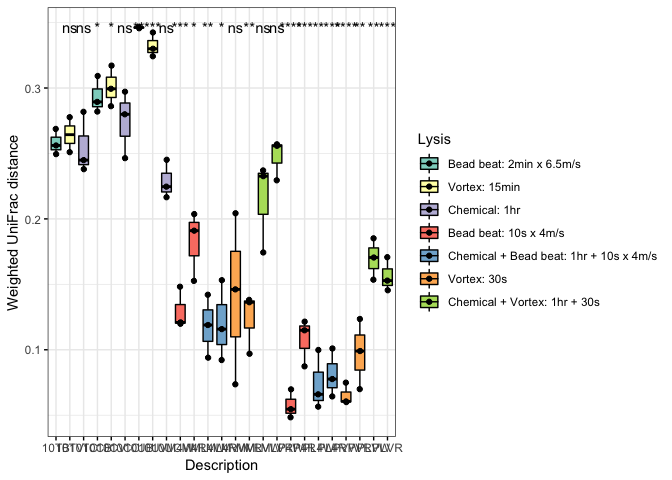

``` r
# Plot for ps6
## Milk vol extraction sample variability (intra-sample distance)
Bray.vol <- read.csv(file.path("distance/organized_bray_6_intra.csv"))
DistBox(Bray.vol, DistMethod = "Bray-Curtis dissimilarity", 
        facet.variable = "Lysis", lvl = c("30ml","10ml","1ml","200ul"),
        comp =  list(c("30ml","10ml"),c("30ml","1ml"),c("30ml","200ul"),
                     c("10ml","1ml"),c("10ml","200ul"),c("1ml","200ul")))
```

    ## Warning: Removed 12 rows containing non-finite values (stat_boxplot).

    ## Warning: Removed 12 rows containing non-finite values (stat_signif).

    ## Warning: Removed 12 rows containing missing values (geom_point).

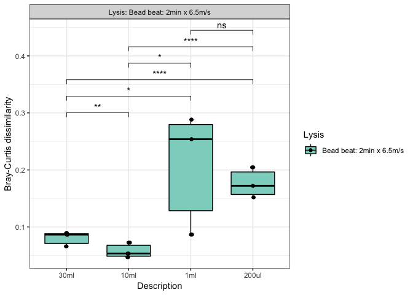

``` r
weighted.vol <- read.csv(file.path("distance/organized_weighted_6_intra.csv"))
DistBox(weighted.vol, DistMethod = "Weighted UniFrac distance", 
        facet.variable = "Lysis", lvl = c("30ml","10ml","1ml","200ul"),
        comp =  list(c("30ml","10ml"),c("30ml","1ml"),c("30ml","200ul"),
                     c("10ml","1ml"),c("10ml","200ul"),c("1ml","200ul")))
```

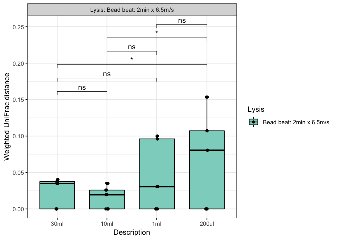

``` r
# Plot for ps.milk
bray.milk <- read.csv(file.path("distance/organized_bray_milk_intra_inter.csv")) 
DistBox(bray.milk,  DistMethod = "Bray-Curtis dissimilarity", 
        lvl = c("intra","inter"),
        facet.variable = "Kit", 
        ref = "intra")
```

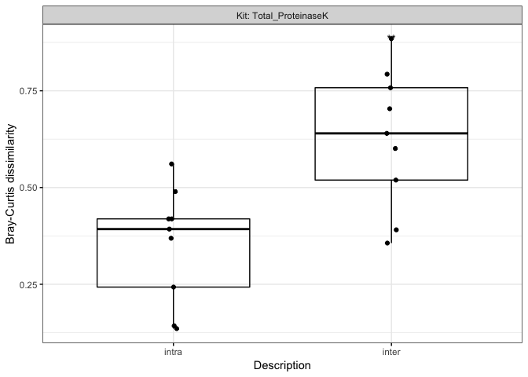

``` r
weighted.milk <- read.csv(file.path("distance/organized_weighted_milk_intra_inter.csv")) 
DistBox(weighted.milk,  DistMethod = "Weighted UniFrac distance", 
        lvl = c("intra","inter"),
        facet.variable = "Kit", 
        ref = "intra") 
```

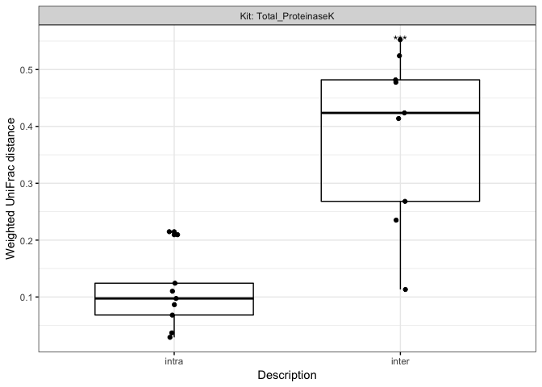

``` r
# Define function to draw cluster dendrogram
DistDendro <- function(dist, ClusterMethod){
  hclust(as.dist(dist), method = ClusterMethod) %>% plot() %>% print()
}

## dendrogram for ps5.rare BCMC2
Bray5 <- DistTab(subset_samples(psList.rare[[5]], For_AVE %in% c("Glycerol","PBS2","Expected2")),
                 "bray")
DistDendro(dist = Bray5, ClusterMethod = "average")
```

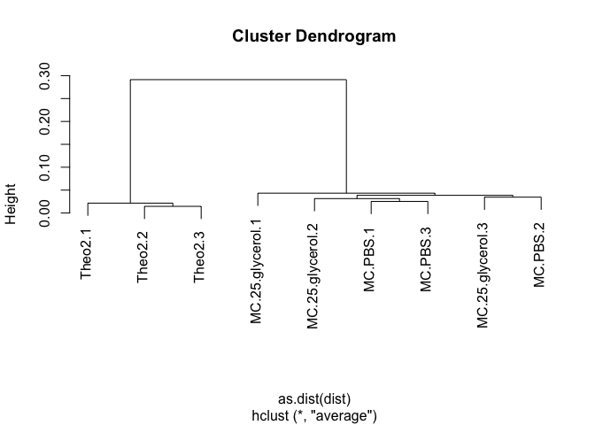

    ## NULL

``` r
Wuf5 <- UniFrac(subset_samples(psList.rare[[5]], For_AVE %in% c("Glycerol","PBS2","Expected2")),
                weighted = TRUE)
DistDendro(dist = Wuf5, ClusterMethod = "average")
```

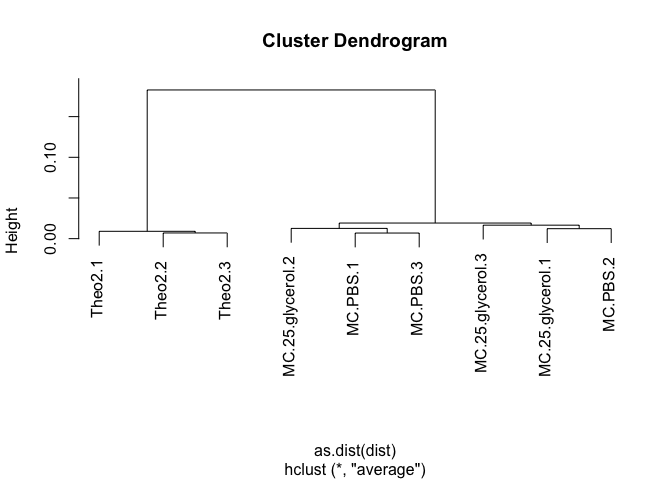

    ## NULL

``` r
## dendrogram for ps5.rare BCMC1
Bray5.2 <- DistTab(subset_samples(psList.rare[[5]], For_AVE %in% c("Fresh","Freeze_Thaw","Expected1")),
                 "bray")
DistDendro(dist = Bray5.2, ClusterMethod = "average")
```

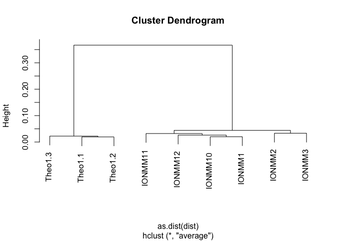

    ## NULL

``` r
# Define function to plot 2D beta diversity dot plot
BetaPlot <- function(ps, ClusterMethod, DistMethod, var1){
  ps.ord <- ordinate(ps, method = ClusterMethod, distance = DistMethod)
  
  print(plot_ordination(ps, ps.ord, color = var1) + 
          geom_point(size=3)+ 
          scale_color_brewer(palette="Paired")+
          ggtitle("")+
          ylab("NMDS2")+ 
          xlab("NMDS1")+
          theme_bw(base_size = 15))
}


# ps6 (sample volume)
BetaPlot(subset_samples(psList.rare[[6]], SampleID != "10TB.1" & SampleID != "10TB.2" & SampleID != "10TB.3"),
         ClusterMethod = "NMDS", DistMethod = "bray", var1 = "For_AVE")
```

    ## Square root transformation
    ## Wisconsin double standardization
    ## Run 0 stress 0.05029754 
    ## Run 1 stress 0.05029784 
    ## ... Procrustes: rmse 0.0001043314  max resid 0.0002080315 
    ## ... Similar to previous best
    ## Run 2 stress 0.1076071 
    ## Run 3 stress 0.05029825 
    ## ... Procrustes: rmse 0.001141983  max resid 0.001845126 
    ## ... Similar to previous best
    ## Run 4 stress 0.05248842 
    ## Run 5 stress 0.05029781 
    ## ... Procrustes: rmse 0.0002257808  max resid 0.0007380758 
    ## ... Similar to previous best
    ## Run 6 stress 0.05248774 
    ## Run 7 stress 0.05029967 
    ## ... Procrustes: rmse 0.0005018065  max resid 0.0008213882 
    ## ... Similar to previous best
    ## Run 8 stress 0.1124697 
    ## Run 9 stress 0.05029814 
    ## ... Procrustes: rmse 0.0002125803  max resid 0.0003929133 
    ## ... Similar to previous best
    ## Run 10 stress 0.06394262 
    ## Run 11 stress 0.1126285 
    ## Run 12 stress 0.06394319 
    ## Run 13 stress 0.0502978 
    ## ... Procrustes: rmse 0.001086249  max resid 0.001734324 
    ## ... Similar to previous best
    ## Run 14 stress 0.05029714 
    ## ... New best solution
    ## ... Procrustes: rmse 0.0007529385  max resid 0.00120639 
    ## ... Similar to previous best
    ## Run 15 stress 0.05908836 
    ## Run 16 stress 0.05029748 
    ## ... Procrustes: rmse 0.0006737608  max resid 0.001084282 
    ## ... Similar to previous best
    ## Run 17 stress 0.05248859 
    ## Run 18 stress 0.05029916 
    ## ... Procrustes: rmse 0.001225464  max resid 0.002040228 
    ## ... Similar to previous best
    ## Run 19 stress 0.05029929 
    ## ... Procrustes: rmse 0.001245565  max resid 0.002048792 
    ## ... Similar to previous best
    ## Run 20 stress 0.05029927 
    ## ... Procrustes: rmse 0.001175894  max resid 0.001885866 
    ## ... Similar to previous best
    ## *** Solution reached

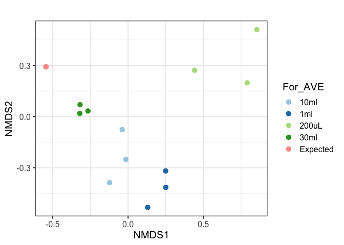

``` r
# ps 4 (PMA)
BetaPlot(psList.rare[[4]], ClusterMethod = "NMDS", DistMethod = "bray", var1 = "For_AVE")
```

    ## Square root transformation
    ## Wisconsin double standardization
    ## Run 0 stress 0.05003465 
    ## Run 1 stress 0.05593021 
    ## Run 2 stress 0.06604928 
    ## Run 3 stress 0.06281171 
    ## Run 4 stress 0.06281167 
    ## Run 5 stress 0.06649344 
    ## Run 6 stress 0.06281337 
    ## Run 7 stress 0.06529209 
    ## Run 8 stress 0.0500352 
    ## ... Procrustes: rmse 0.0002897485  max resid 0.0008730164 
    ## ... Similar to previous best
    ## Run 9 stress 0.04918987 
    ## ... New best solution
    ## ... Procrustes: rmse 0.02951826  max resid 0.07996029 
    ## Run 10 stress 0.05519852 
    ## Run 11 stress 0.0500365 
    ## Run 12 stress 0.05519848 
    ## Run 13 stress 0.05519841 
    ## Run 14 stress 0.05592991 
    ## Run 15 stress 0.06528798 
    ## Run 16 stress 0.06280937 
    ## Run 17 stress 0.05519835 
    ## Run 18 stress 0.06604318 
    ## Run 19 stress 0.06281205 
    ## Run 20 stress 0.06720072 
    ## *** No convergence -- monoMDS stopping criteria:
    ##     20: stress ratio > sratmax

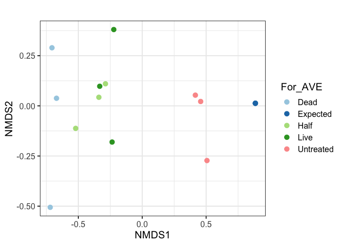

``` r
# Define function for making heatmap of distance from Exp 
DistHeat <- function(df, lvl){
  superheat(df,
            left.label.size = 0.7,
            bottom.label.size = 0.1,
            left.label.text.size = 4,
            #heat.lim = c(min(df[1:3]),max(df[1:3])),
            # change the color
            #heat.col.scheme = "red",
            scale = TRUE,
            order.rows = order(-df$order_factor))
}

# Plot for all method ps1-ps8 (actually 1-7 because 8 is NC )
## read in organized Bray-Curtis dissimilarity file
bray.1to8exp <- read.csv(file.path("distance/organized_bray_1to8_Exp.csv"))
bray.1to8exp.ave <- bray.1to8exp %>% group_by(For_AVE) %>% 
  summarise(Theo1.1 = mean(Theo1.1), Theo1.2 = mean(Theo1.2), Theo1.3 = mean(Theo1.3)) %>% 
  data.frame()
bray.1to8exp.ave <- merge(bray.1to8exp.ave,
                          read.csv(file.path("distance/lvl_organized_bray_1to8_Exp.csv")),
                          by = "For_AVE")
row.names(bray.1to8exp.ave) <- bray.1to8exp.ave$For_AVE
bray.1to8exp.ave <- bray.1to8exp.ave[,c("Theo1.1","Theo1.2","Theo1.3","order_factor")]
## Plot
DistHeat(bray.1to8exp.ave)
```

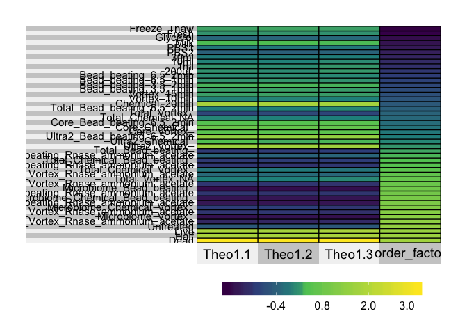

``` r
DistHeat(subset(bray.1to8exp.ave, !row.names(bray.1to8exp.ave) %in% c("Untreated","Live","Dead","Half")))
```

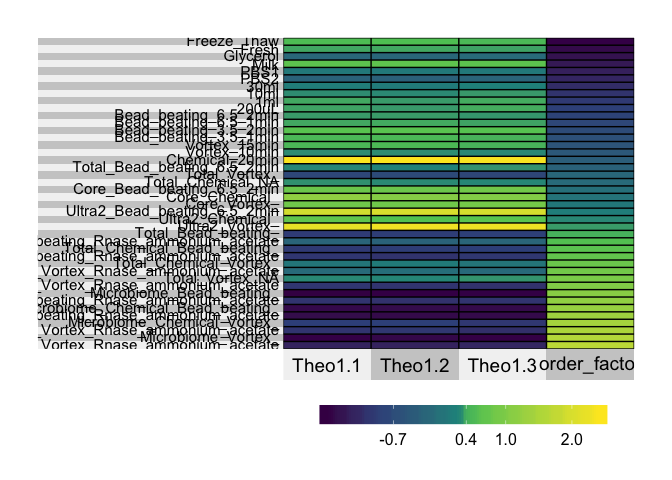

``` r
# Afterwards, I remove the order factor column in Adobe Illustrator
```

#### Alpha diversity

``` r
# Define function that plots out alpha box plot as well as p values
AlphaBox <- function(ps, alpha_measures, var1, var, lvl){
  df <- estimate_richness(ps, split = TRUE, measures = alpha_measures) 
  row.names(df) <- gsub("X","",row.names(df) )
  # add sample metadata information
  df <- merge(df, data.frame(sample_data(ps)), by.x = 'row.names', by.y = 'row.names')
  df <- df[, -1]
  # Melt dataframe for plotting figures
  dfm <- melt(df, id.vars = c("SampleID", var),
              variable.name = "measure", value.name = "value")
  dfm[[var1]] <- factor(dfm[[var1]], levels = lvl)
  
  p<- ggboxplot(dfm, x = var1, y = "value", add = "jitter", palette = "Set3",
                font.label = list(size = 18, face = "plain"), ggtheme = theme_bw())+
    stat_compare_means(method = "t.test", ref.group = "Expected", 
                       hide.ns = TRUE,  label = "p.signif")

  facet(p, facet.by = "measure", scales = "free") %>% print()
}

# Alpha box plot on ps6 (sample volume)
AlphaBox(subset_samples(psList.rare[[6]], SampleID != "10TB.1" & SampleID != "10TB.2" & SampleID != "10TB.3"),
         # subset to include only one set of 10ml samples 
         alpha_measures = c("Observed", "Shannon"),
         var1 = "For_AVE", var = c("KIT","For_AVE","STORAGE","MATRIX","PMA",
                                   "SampleOrCtrl","LYSING","Chemical_time",
                                   "Bead_beat_speed_time","vortex_time","Description"),
         lvl = c("Expected","30ml","10ml","1ml","200uL"))
```

    ## Warning: Computation failed in `stat_compare_means()`:
    ## data are essentially constant

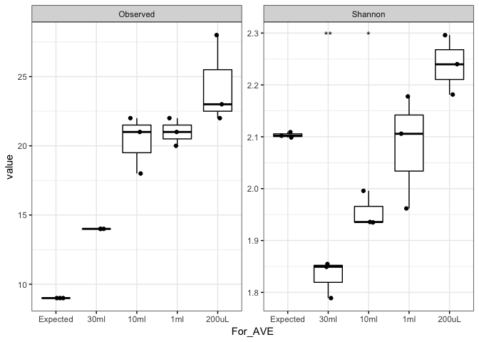

``` r
# Alpha box plot on ps 4 (PMA)
AlphaBox(psList.rare[[4]], alpha_measures = c("Observed", "Shannon"),
         var1 = "For_AVE", var = c("KIT","For_AVE","VOL","STORAGE","MATRIX","PMA",
                                   "SampleOrCtrl","LYSING","Chemical_time",
                                   "Bead_beat_speed_time","vortex_time","Description"),
         lvl = c("Expected","Untreated","Live","Half","Dead"))
```

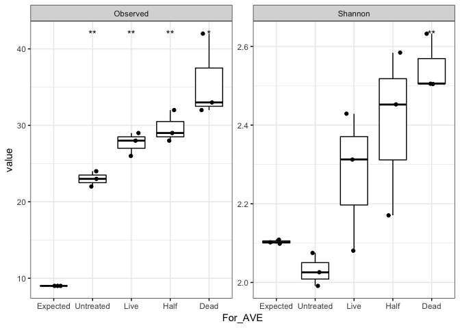

qPCR results
------------

### PMA on single bacterial strain or gDNA

``` r
# PMA on E.coli gDNA 
PMA.conc <- read.csv(file.path("data/10min_conc.csv"))
gghistogram(PMA.conc, x = "Ct_diff",
            add = "mean", rug = TRUE, color = "Treatment", fill = "Treatment",
            palette = c("#00AFBB", "#E7B800"))
```

    ## Warning: Using `bins = 30` by default. Pick better value with the argument
    ## `bins`.

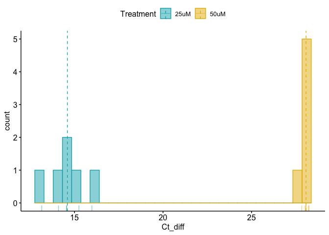

``` r
print(ggboxplot(PMA.conc, x = "Treatment", y = "Ct_diff",
                font.label = list(size = 18, face = "plain"), 
                ggtheme = theme_bw()) +
        stat_compare_means(method = "kruskal", hide.ns = TRUE, label = "p.signif"))
```

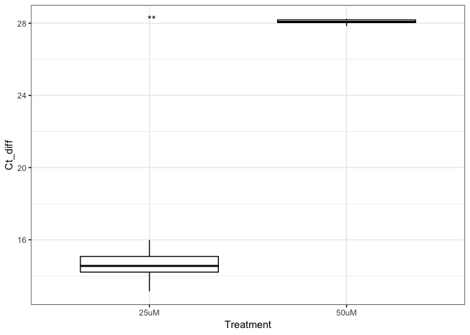

``` r
# PMA on 3 species strain 
PMA.T <- read.csv(file.path("data/50uM_time.csv"))
PMA.T$Cell_state <- factor(PMA.T$Cell_state, levels = c("Live", "Half", "Dead"))
## make a df to p value annotation
df.anno <- compare_means(PerOf_untreated ~ Treatment, method = "kruskal.test",
                         group.by = "Cell_state", 
                         data = subset(PMA.T, Species == "Escherichia coli")) %>% mutate(y_pos = 12)
# not significant 
print(ggboxplot(subset(PMA.T, PerOf_untreated != "NA"), 
                x = "Treatment", y = "PerOf_untreated", color = "Cell_state",
                font.label = list(size = 18, face = "plain"), 
                palette = "jco", ggtheme = theme_bw()) +
        facet_wrap(~Species, scales = "free_x"))
```

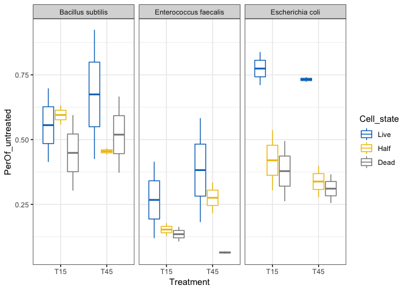

``` r
# PMA on MC 
PMC.mc <- read.csv(file.path("data/MC_total.csv"))
PMC.mc$Cell_state <- factor(PMC.mc$Cell_state, levels = c("Live", "Half", "Dead"))

print(ggboxplot(subset(PMC.mc, PerOf_untreated != "NA"), 
                x = "Cell_state", y = "PerOf_untreated", color = "Cell_state",
                font.label = list(size = 18, face = "plain"), 
                palette = "jco", ggtheme = theme_bw()) +
        stat_compare_means(method = "kruskal.test", hide.ns = TRUE,  label = "p.signif"))
```

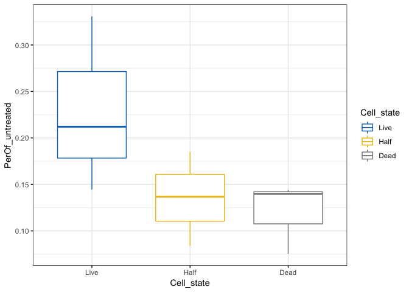

``` r
# Adjust proportion with qPCR counts
## transform to percentage
ps4q <- psList[[4]] %>% transform_sample_counts(function(x) x/sum(x) )  
otuq <- otu_table(ps4q) %>% t() %>% data.frame()
otuq$Sampleid <- row.names(otuq)
colnames(otuq) <- gsub("X","",colnames(otuq))
## merge qPCR and percent
otu.q <- merge(x = PMC.mc, y = otuq, by.x = "SampleID", by.y = "Sampleid")
coln <- colnames(otu.q[,c(8:107)]) #  character vector with all feature names
otu.q2 <- otu.q %>% mutate_at(.vars =  coln, .funs = funs(.*Log))
row.names(otu.q2) <- otu.q2[,1] #sample id as row names for formatting with phyloseq
otu.q3 <- otu.q2[,-c(1:7)] #remove all the meta information so the resulting otu table can be transformed into a numeric matrix
otu.q3 <- as.matrix(otu.q3)
# Merge as a new phyloseq object
ps4q <- phyloseq(otu_table(otu.q3, taxa_are_rows = FALSE), tax_table(ps4q),
                 sample_data(ps4q), phy_tree(ps4q))
ps4q
```

    ## phyloseq-class experiment-level object
    ## otu_table()   OTU Table:         [ 100 taxa and 15 samples ]
    ## sample_data() Sample Data:       [ 15 samples by 13 sample variables ]
    ## tax_table()   Taxonomy Table:    [ 100 taxa by 7 taxonomic ranks ]
    ## phy_tree()    Phylogenetic Tree: [ 100 tips and 99 internal nodes ]
